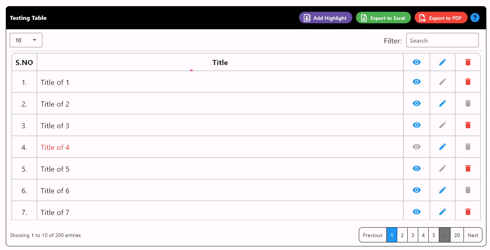
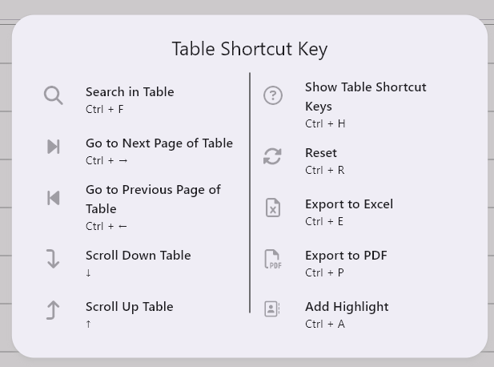

# Common Data Table

A Flutter package for all platform will provide a Common Data Table same like data table with search filter, set limits, export excel / pdf and also edit, delete option and  actions.

## Features:

* Able to Edit / Delete row as you went.
* Able to Search and Set Limit dropdown like Bootstrap / Ajax DataTable in php.
* Able to Export to PDF and Excel File.
* Able to add many more action


## Installation

First, add this to your package's pubspec.yaml file:
```
dependencies:
  common_data_table: {lastest_version}
```

Now in your Dart code, you can use:
```
import 'package:common_data_table/common_data_table.dart';
```
 
## Examples
# Table


# Shortcuts


# Calling
```
CommonDataTable(
    isSearchAble: true,
    sortColumn: [1],
    title: "Testing Table",
    titleBgColor: Colors.black,
    titleStyle: TextStyle(
      fontSize: 16,
      color: Colors.white,
      fontWeight: FontWeight.bold,
    ),
    heading: [
      'S.NO',
      'Title',
    ],
    rowActionButtons: [
      RowActionButton(
        tooltip: "View Image",
        icon: Icons.remove_red_eye,
        isDisabled: (index) {
          if (index == 3) {
            return true;
          }
          return null;
        },
        onTap: (index) {},
        color: Colors.blue,
      )
    ],
    tableActionButtons: [
      TableActionButton(
        child: Text("Add Highlight"),
        onTap: () {
          print("add");
        },
        shortcuts: SingleActivator(
          LogicalKeyboardKey.keyA,
          control: true,
        ),
        icon: Icon(
          FontAwesomeIcons.addressBook,
          size: 20,
        ),
      )
    ],
    data: [
      for (int i = 1; i <= 200; i++) ...[
        [
          '$i.',
          'Title of $i',
        ],
      ]
    ],
    headingAlign: {
      0: TblAlign.center,
      1: TblAlign.center,
    },
    dataAlign: {
      0: TblAlign.center,
    },
    onEdit: (index) {},
    onDelete: (index) {},
    disabledDeleteButtons: [1, 3, 5],
    disabledEditButtons: [0, 2, 4],
    dataTextStyle: (row) {
      if (row[0] == '4.') {
        return {
          1: TextStyle(
            color: Colors.red,
            fontSize: 20,
          )
        };
      }
      return null;
    },
    onExportExcel: (file) async {
      await launchUrl(Uri.file(file.path));
    },
    onExportPDF: (file) async {
      await launchUrl(Uri.file(file.path));
    },
    )
```